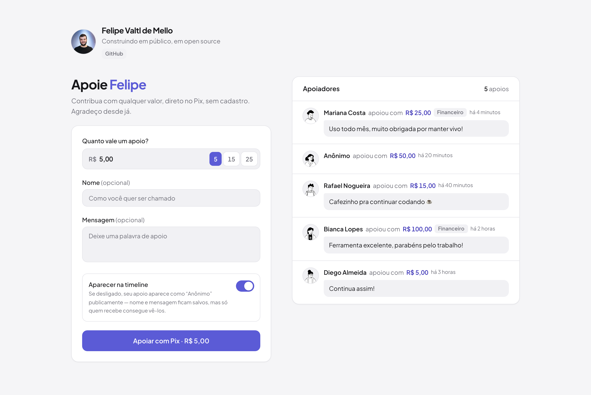

# apoia

Uma página simples para receber apoio via Pix — pensada para quem mantém projetos
open source no Brasil. Inspirada no [Buy Me a Coffee](https://buymeacoffee.com), mas
focada no público brasileiro: **só Pix**, sem coletar e-mail, CPF ou telefone.

Self-hosted, open source. A configuração do site — identidade do criador (nome,
avatar, links), produtos e o formulário de apoio — é toda feita por um admin com
login via Google ([shoo.dev](https://shoo.dev)); Pix, banco e alguns detalhes de
infra continuam por variáveis de ambiente.

[](https://github.com/valtlfelipe/apoia/actions/workflows/release.yml)
[](https://github.com/valtlfelipe/apoia/releases)
[](LICENSE)



*Nome e apoiadores de demonstração, com dados fictícios.*

## O que ela faz

- **Uma página, com timeline pública** de apoios, no estilo Buy Me a Coffee.
- **Apoio anônimo de verdade**: quem não quer aparecer é salvo como "Anônimo" +
  valor na timeline — nome e mensagem continuam privados no banco, nunca saem dele.
- **Avatares gerados** ([DiceBear](https://www.dicebear.com)), sem depender de nome
  ou e-mail — a semente é sempre um ID opaco, mesmo para apoios públicos.
- **Páginas de produto opcionais**: `/financeiro` mostra "Apoie Felipe no
  desenvolvimento do Financeiro"; a raiz aceita apoio genérico. Tudo cai na mesma
  timeline compartilhada. Gerenciadas pelo `/admin` (veja [Admin](#admin)).
- **Admin**: configura a identidade do criador, cadastra produtos e mostra os
  apoios com nome e mensagem reais — inclusive de quem pediu para ficar anônimo na
  timeline, com a opção de tirar (ou devolver) alguém da vitrine pública.
- **Pix modular**: a integração com o provedor de pagamento é uma interface
  (`PixProvider`) — hoje só a [Woovi](https://woovi.com) está implementada, mas
  trocar (ou adicionar um segundo provedor) é escrever um arquivo novo.
- **SQLite + Drizzle ORM**: um arquivo, fácil de fazer backup, nenhuma query SQL
  crua na aplicação.


## Deploy (self-host)

Não precisa clonar o repositório nem instalar Node — só Docker. A cada release,
o workflow em `.github/workflows/release.yml` builda a imagem (`linux/amd64` e
`linux/arm64`) e publica no GitHub Container Registry.

1. Crie uma pasta pra sua instância e, dentro dela, um `docker-compose.yml`:

   ```yaml
   services:
     apoia:
       image: ghcr.io/valtlfelipe/apoia:latest
       ports:
         - "3000:3000"
       env_file:
         - .env
       environment:
         DATABASE_PATH: /data/apoia.db
       volumes:
         - apoia-data:/data
       restart: unless-stopped

   volumes:
     apoia-data:
   ```

   (Rodando seu próprio fork? Troque `valtlfelipe/apoia` pelo seu — o release
   publica automaticamente em `ghcr.io/<seu-usuário>/<seu-fork>`.)

2. Crie o `.env` na mesma pasta, com base na seção [Configuração](#configuração-variáveis-de-ambiente)
   abaixo — no mínimo `APOIA_SITE_URL`, `WOOVI_APP_ID`, `APOIA_ADMIN_EMAIL` e
   `APOIA_ADMIN_SECRET`. As duas últimas são a sua conta de login do
   [`/admin`](#admin) — é lá que você configura nome, avatar, links e produtos, não
   mais pela ENV.

3. Suba:

   ```bash
   docker compose pull
   docker compose up -d
   ```

4. Acesse `https://seu-domínio.com/admin`, entre com a conta Google que você pôs em
   `APOIA_ADMIN_EMAIL`, e configure o resto em [Configurações](#admin). Até lá, a
   instância mostra os padrões do código (nome "Apoia", sem produtos).

As migrations do banco rodam automaticamente a cada boot do container, antes do
servidor subir (veja `docker-entrypoint.sh`) — não tem passo manual de migration
no deploy. Os dados ficam no volume nomeado `apoia-data`, sobrevivem a updates e
restarts.

Pra atualizar depois de uma nova release:

```bash
docker compose pull
docker compose up -d
```

Tags disponíveis: `latest` e `<major>.<minor>.<patch>` (ex.: `0.1.0`) a partir de
cada release marcada com uma tag `vX.Y.Z`; `edge` fica disponível quando o
workflow é disparado manualmente a partir da `main`.

## Configuração (variáveis de ambiente)

Tudo fica no `.env`. Veja `.env.example` para a lista completa comentada — aqui vai
o resumo:

### Site

| Variável | Obrigatória | Descrição |
|---|---|---|
| `APOIA_SITE_URL` | sim | URL pública desta instância (usada em metadata, no registro do webhook e como origin do login OAuth). |
| `APOIA_RATE_LIMIT_PER_MINUTE` | não | Limite de criação de cobranças por IP. Padrão: `5`. |

### Pix

| Variável | Descrição |
|---|---|
| `PIX_PROVIDER` | Qual módulo em `lib/pix/providers` usar. Hoje: `woovi`. |
| `WOOVI_APP_ID` | App ID gerado no painel da Woovi → Applications. **Nunca vai para o navegador.** |
| `WOOVI_API_URL` | Padrão `https://api.woovi.com/api/v1`. |
| `WOOVI_WEBHOOK_TOKEN` | Opcional — token extra verificado no header `Authorization` do webhook. |
| `WOOVI_WEBHOOK_PUBLIC_KEY` | Opcional — sobrescreve a chave pública usada para validar a assinatura do webhook (rotação de chave / sandbox). |

### Banco de dados

`DATABASE_PATH` — caminho do arquivo SQLite (padrão `./data/apoia.db`; no Docker é
fixado em `/data/apoia.db`, dentro do volume).

### Admin

| Variável | Obrigatória | Descrição |
|---|---|---|
| `APOIA_ADMIN_EMAIL` | sim | A única conta Google autorizada a entrar em `/admin`. |
| `APOIA_ADMIN_SECRET` | sim | Assina o cookie de sessão do admin. Gere com `openssl rand -base64 32`. |

É por ele que se configura o site — não tem como rodar sem essas duas. Veja
[Admin](#admin) abaixo.

## Configurando a Woovi

1. Crie uma conta em [woovi.com](https://woovi.com) e gere um **App ID** em
   *Applications* no painel.
2. Coloque em `WOOVI_APP_ID` no `.env`.
3. Depois do deploy (com `APOIA_SITE_URL` apontando para uma URL pública HTTPS),
   registre o webhook — direto via `curl`, apontando pra
   `$APOIA_SITE_URL/api/webhooks/woovi`, que é a rota que este projeto expõe pra
   receber a confirmação de pagamento:

   ```bash
   export WOOVI_APP_ID="..."                        # o mesmo do .env
   export WOOVI_API_URL="https://api.woovi.com/api/v1"  # sandbox: api.woovi-sandbox.com
   export APOIA_SITE_URL="https://seu-dominio.com"

   for event in OPENPIX:CHARGE_COMPLETED OPENPIX:CHARGE_EXPIRED; do
     curl -X POST "$WOOVI_API_URL/webhook" \
       -H "Authorization: $WOOVI_APP_ID" \
       -H "Content-Type: application/json" \
       -d "{\"name\":\"apoia — $event\",\"event\":\"$event\",\"url\":\"$APOIA_SITE_URL/api/webhooks/woovi\",\"isActive\":true}"
   done
   ```

   Isso é um passo único por deploy (refaça só se `APOIA_SITE_URL` mudar) — não tem
   variável nem script deste projeto que faça isso por você; é uma chamada direto na
   API da Woovi, no painel dela ou por `curl` mesmo.

O webhook é a fonte de verdade para confirmar pagamento — a página também faz
*polling* de status a cada poucos segundos como reforço, útil em ambientes onde o
webhook ainda não foi configurado (dev local, por exemplo).

## Admin

Obrigatório — sem `APOIA_ADMIN_EMAIL`/`APOIA_ADMIN_SECRET` a instância nem sobe (o
boot recusa configuração inválida). É por ele que se configura:

- **Configurações**: identidade do criador (nome, nome curto usado nas headlines,
  tagline, URL do avatar, links) e o formulário de apoio (valores sugeridos,
  mínimo/máximo, os três checkboxes da timeline, estilo do avatar gerado, validade
  da cobrança Pix, mensagem de agradecimento do modal de sucesso).
- **Produtos**: criar, editar, ativar/desativar e (se ainda não tiver apoios)
  excluir as páginas `/<slug>`.
- **Apoios**: uma lista com nome e mensagem **reais**, mesmo de quem marcou
  "aparecer como anônimo" na timeline pública — com um botão para ocultar (ou
  devolver) alguém da vitrine. Ver [Privacidade e segurança](#privacidade-e-segurança)
  abaixo.
- **Sobre**: versão instalada (vem automaticamente da tag da release — builds
  locais mostram "dev"), checagem de nova versão no GitHub, e links para apoiar o
  projeto, ver o repositório, reportar bug ou sugerir funcionalidade.

O login usa o Google via [shoo.dev](https://shoo.dev), um broker de autenticação
minimalista: você clica em "Entrar com Google", ele confirma sua identidade e
devolve um token assinado — o apoia verifica esse token no servidor (nunca no
navegador) e só libera a sessão se o e-mail confirmado bater com
`APOIA_ADMIN_EMAIL`. A sessão em si é um cookie próprio do apoia, independente do
shoo.

## Privacidade e segurança

- **Nenhum dado pessoal é coletado** além do que a pessoa opcionalmente digita: nome
  e mensagem. Sem e-mail, CPF ou telefone.
- **Anônimo na vitrine pública, não no banco**: se a pessoa desmarcar "aparecer na
  timeline", a API pública (`/api/timeline` e a própria página) nunca retorna o
  nome ou a mensagem reais — só "Anônimo" e o valor. Os dados reais ficam no
  SQLite e são visíveis só para `APOIA_ADMIN_EMAIL`, pelo `/admin` — nunca pela API
  pública.
- **Payload do webhook é higienizado antes de salvar**: a Woovi manda o nome e o
  CPF de quem pagou dentro do evento de confirmação — esse bloco é removido antes
  de qualquer persistência, inclusive do log de auditoria (`webhook_events`).
- **Assinatura do webhook é verificada** (RSA, chave pública da Woovi) antes de
  processar qualquer payload.
- **Rate limiting** por IP na criação de cobranças (o IP em si nunca é salvo — só
  um hash em memória, que expira).
- Headers de segurança (CSP, HSTS, `X-Frame-Options`, etc.) configurados por padrão
  em `next.config.ts`. O `img-src` aceita qualquer origem `https:` — necessário
  porque a URL do avatar do criador agora é configurável em runtime (pelo
  `/admin`), não mais fixada no boot — mas `script-src` continua travado em
  `'self'` e não existe superfície de injeção de HTML na aplicação (nenhum
  `dangerouslySetInnerHTML`), então isso não abre caminho pra script malicioso.

## Desenvolvimento local

Pra mexer no código (não necessário só pra hospedar). Requer Node.js 24+ e
[pnpm](https://pnpm.io).

```bash
git clone https://github.com/valtlfelipe/apoia.git
cd apoia
pnpm install
cp .env.example .env      # edite com seus dados (veja a seção de ENVs acima)
pnpm db:generate           # só na primeira vez, ou após mudar lib/db/schema.ts
pnpm db:migrate
pnpm dev
```

Abra http://localhost:3000.

Sem um `WOOVI_APP_ID` de verdade, o formulário de apoio vai falhar ao criar a
cobrança (esperado) — mas a página, a timeline e as validações funcionam normalmente
com dados de teste inseridos direto no SQLite (ex.: uma linha `paid` pra ver como a
timeline renderiza). Testar o fluxo de confirmação de ponta a ponta requer uma conta
Woovi de verdade (sandbox inclusa) — sem ela, o webhook nunca chega e a assinatura
sempre precisa bater com o payload real da Woovi.

Pra buildar a imagem localmente em vez de usar a publicada (útil testando
mudanças no `Dockerfile`):

```bash
docker compose up -d --build
```

## Stack

Next.js 16 (App Router) · React 19 · Tailwind CSS v4 · Drizzle ORM · SQLite
(`better-sqlite3`) · Zod · TypeScript.

## Adicionando outro provedor de Pix

Toda a integração de pagamento passa pela interface `PixProvider`
(`lib/pix/types.ts`). Para adicionar um novo provedor:

1. Crie `lib/pix/providers/<nome>.ts` implementando `PixProvider`
   (`createCharge`, `getChargeStatus`, `verifyWebhook`, `parseWebhook`,
   `redactWebhookPayload`).
2. Registre em `lib/pix/index.ts`.
3. Adicione o nome ao enum `PIX_PROVIDER` em `lib/config/env.ts`.

Nenhum componente de UI ou lógica de domínio referencia um provedor específico —
só o registry.

## Trocando o driver de SQLite

Por padrão a app usa `better-sqlite3` (via `serverExternalPackages` no
`next.config.ts`, para o Docker copiar o binário nativo certo). Para usar o driver
nativo do Node (`node:sqlite` — zero dependências nativas, mas ainda experimental),
troque a implementação em `lib/db/client.ts`: é o único lugar que fala diretamente
com o driver — o resto da aplicação só usa o query builder do Drizzle.

## Publicando uma release

Pra quem mantém o projeto (não necessário só pra hospedar):

1. Mova as mudanças relevantes de `[Unreleased]` para uma nova seção no
   [`CHANGELOG.md`](CHANGELOG.md), no formato `## [X.Y.Z] - AAAA-MM-DD`.
2. Atualize `"version"` em `package.json` pro mesmo número.
3. Marque e envie a tag:

   ```bash
   git tag vX.Y.Z
   git push origin main vX.Y.Z
   ```

O workflow `.github/workflows/release.yml` builda a imagem multi-arch, publica
no GHCR com as tags `latest`, `X.Y.Z`, `X.Y` e `X`, e cria a GitHub Release com
as notas tiradas direto da seção correspondente do changelog.

## Scripts

| Comando | O que faz |
|---|---|
| `pnpm dev` | Servidor de desenvolvimento. |
| `pnpm build` / `pnpm start` | Build e start de produção. |
| `pnpm db:generate` | Gera uma migration a partir de `lib/db/schema.ts`. |
| `pnpm db:migrate` | Aplica as migrations pendentes. |
| `pnpm db:studio` | Abre o [Drizzle Studio](https://orm.drizzle.team/drizzle-studio/overview) para inspecionar o banco. |
| `pnpm check` | Lint (Biome) + typecheck. |

## Licença

AGPL-3.0-only.
